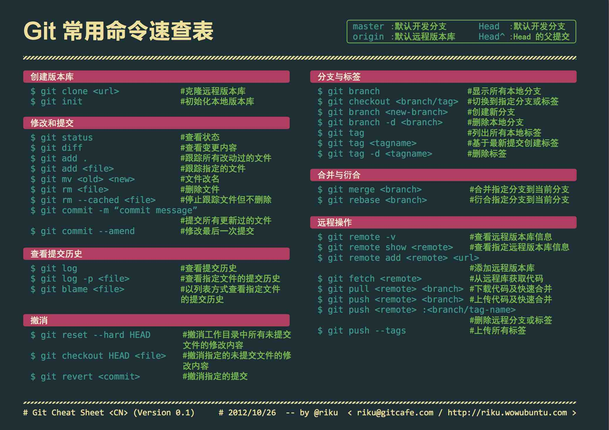

# The git command that is used frequently at work

## 常规提交

>  切换到本地仓库

*  cd /Users/Mr.Li/Documents/vue-project

>  初始化，变成git可管理（用于新建仓库）
*  git init

>  提交要更新的文件  ( . 表示全部)

*  git add .

>  提交注释

*  git commit -m '提交的注释'

>  查看是否提交缓冲区正常

*  git status

>  在本地的仓库下运行命令，把本地仓库与远程仓库关联

*  git remote add origin https://xxxxxxxxxx.git

>  第一次提交要加上 -u ，建立关联，以后不需要

*  git push -u origin master (首次提交)

*  git push origin master

## 远程克隆仓库

*  cd xxxxxx (存放路径)

*  git clone https://xxxxxxxxxx.git (远程仓库地址)


## 同一个分支分工合作解决冲突

*  git pull origin master (拷贝远程代码到本地，并自动合并) 

*  git fetch origin master （只下载远程仓库，不自动合并，需要手动）

*  git diff (查看哪些文件存在冲突，做好沟通工作)

>  若存在冲突，进入冲突所在文件，冲突区域为以下标识

```

a123
<<<<<<< HEAD
b789
=======
b45678910
>>>>>>   6853e5ff961e684d3a6c554d4d06183b5ff330dcc

其中：冲突标记<<<<<<< （7个<）与=======之间的内容是我本人的修改，=======与>>>>>>>之间的内容是别人的修改。
```

>  若已经没有冲突存在

*  git add .

*  git commit -m "合并代码"

*  git status (查看是否已经提交缓存区)

*  git push origin master

## 版本回退

>  当有时候项目出现莫名的bug时，在工期比较赶的情况下选择版本回退，保证项目可使用

```

git reset 47f94424978e92845c7c7eb887bca4c5e3a096154    (后面是版本号)

git add .

git commit -m "回退版本"

git push origin master
```

## 常用的git命令
